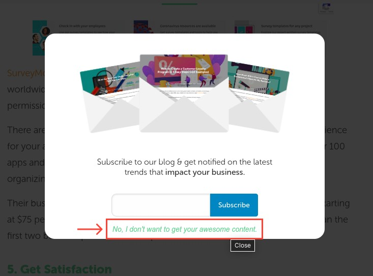

Put down the pitchforks. Let me explain.

## What "empathy" means

Empathy is the capacity to understand or feel what another person is experiencing from within their frame of reference, that is, the capacity to place oneself in another's position.
And Empathic Design caters to real user needs, rather than supposed “averages”. 

With that in mind, let's ask ourselves a basic question.

Can you really understand what each of the thousands or millions of potential users of your application are going to think or feel? What they like/dislike, they way they see the world, how they approach their daily tasks, etc. Is that even possible?

And even if it is, is it even the right thing to do? Is it even useful?

## The current state of "empathy in design"

The generally accepted idea of empathy as a part of Design Thinking is understanding how the user feels when interacting with a certain product or interface. This would involve asking questions such as; does the layout of this website evoke feelings of frustration? What emotions does the user go through when navigating this app?

Sounds reasonable, right? Everyone should be doing that!

But you see, that's when it gets tricky. What does that *mean*, exactly? Wouldn't knowing something like a layout being frustrating simply be design sensibility (or even common sense)? Why do I care if a person using an accounting app sees a warm and fuzzy button prompt?
Where does empathy come into this?

## So what went wrong?

Empathy has become a overused buzzword designers are obsessed with using. It's become one of those umbrella terms which don't really mean anything anymore. Much like Design Thinking. Ask someone to define that, and it starts sounding suspiciously like 'common sense'.

Let's do another thought exercise:

- Can you, as (for example) a Tier-1 city educated 25-year-old designer, really understand or feel what a 65-year-old Chartered Accountant from Indore is experiencing? 
- Would you have the context and life experiences and observations required to be able to objectively and accurately anticipate that?
- Will you really be able to apply the empathetic understanding from 1, 5, 10, or even 20 people to the thousands of potential users to the application?
- If not, will you be able to empathise all the thousands or millions of users of the applications you're designing?

The concept of personas is often touted as a solution to this problem. You build out a hypothetical person with some assumed attributes to figure out how to design for this person. If done right, this can typically help in building brand identities.
Thing is, these attributes don't really help in building a solution to a user's problem. Because:
- The problem a user faces might not be affected by their attributes
- A user may have multiple problems which don't fit into any particular set of attributes to consider for a persona

When you're figuring out how a user will accomplish a certain task, empathy has little to do with it. What you're trying to understand is what steps the user will take to accomplish that task, and how, in context of their usage, they're going to do that. Whether I'm frustrated, happy, heartbroken, or horny has little to do with how I'm going to generate an analytics report from my dashboard or order in food on an app.

## But isn't that empathy?

No quite the same, no. 

Empathy is not a warm and fuzzy illustration in your onboarding or success screens. Empathy is not an affirmative title copy in a notification.

"Don't put frequently used items hidden under 3 clicks" is not empathy. It's just common sense. Even a psychopath without empathy can tell you that.

Unfortunately, empathy in UX design has take on a more branding/marketing paradigm in how it _wants_ to make its users _feel_. In the name of "empathetic design", we're seeing more and more designs throwing out basics of usability and hueristics for the purpose of generating a certain "feel" (all those times you see a UI with massive, barely visible text, oddly placed buttons, hopelessly abstract icons, etc.). This is made worse by the desire to make these "Dribbble-worthy" shots for 'aesthetics', rather than showing any UX prowess. A part of this comes from businesses not having the required design education to understand UX vs a fancy UI.

No matter what you do, you're not going to know and understand exactly what someone else thinks and feels. 
You can, at best, understand how 1 person you're designing for is going to feel.

But you're not designing for 1 person. You're designing something that will be used by a lot of people with their own unique way of thinking and feeling. The decision of "where should this button go" is not driven by empathy. You cannot quantify the argument of "the user will feel X due to Y". 

We, as designers, should not delude ourselves into thinking we can get into the minds of the millions of users across the globe and understand them. 

This hubris is why so many "empathy-driven" products fail.

## "But my professor said I should empathize MAXXX!"

With all due respect to your professor, things in the academic realm are different from those in the real world. The luxury of debating idealistic UX is not afforded in a market where the end objective is to put food on the table. Someone has to finish designing the UX/UI, someone has to finish developing it, and someone has to deploy and market it so that it can start making some money for the business. This is a practicality often ignored in academic pursuits of design. 

Not every product you work on is going to have the resources required to send out a field team of anthropologists or design researchers to talk to people in the streets. Your work is going to be constrained by the tech feasibility, budget, timelines, etc. Even in the projects where these resources are plentiful, the track record for success is dismal. They either completely fail, take a lot longer than expected, or cost much more than had been budgeted. 

More often than not, designs are not even tested because it was 'designed with empathy'. That's one of the reasons you'll see large amounts of time and money invested in building features and applications which are barely usable, if anyone even wants to use them.

Consultants and specialists can claim to solve these problems, but that's also a hit-or-miss situation. In my own experience, we've had projects where an expert claimed a certain behaviour pattern would be addressed by a particular flow, only to later realise that in the target audience, there are cultural influences which dictate how they go about that activity, making it drastically different. And this was for a B2B app where the audience is yet limited. What do you think happens in a B2C application?

### So is empathy garbage?

Well, no. 

## Okay. So what _should_ empathy in design look like?

The focus of empathy as a part of design needs to be on the practicality of the task the users are trying to accomplish. Empathy has to mean being **_considerate_** of your users' capabilities. 

- How will someone with a disability use your application? How will you accomodate for their needs?
- Would your application work for people who don't have powerful hardware?
- Will new users easily be able to understand how to use your application, or is there an inherent skill wall?

That is what you're designing for.

Do you see a pattern here? What you're designing for is accessibility, with the intent of ensuring that users can do what they came to do with the minimum amount of friction possible; not to make them feel warm and fuzzy on the inside. The goals is to enable users to use your application by building in the flexibility and accomodation
The cute puppy mascot which made me go "aww" on the error page is ultimately useless if it doesn't help the user identify/fix the problem or present an alternative.

These design decisions come from designing for the task users are trying to do, and improving your designs based on usage patterns, not on what you think they feel. Through iterations based on the understandings from this data, you'll eventually be able to get to a product that works for the people using it. 

Data will tell you what users are doing. Reason and empathy will help you understand why they're doing it.

For example: You made an exit modal for a massive discount or some other benefit, but no one's using it. The layout is perfect, the colours are right. What's going wrong?

Maybe you're using copy for the buttons like "Yes! Give me the discount!" and "Nah, I don't like saving money", inadvertantly insulting your user. User thinks "hey f*ck you" and closes the tab.

>See what I mean?

There are plenty of tools which will help you get quantitative ([Google Analytics](http://analytics.google.com/), [Firebase](https://firebase.google.com/), etc.) as well as qualitative ([Hotjar](https://www.hotjar.com/), [SurveyMonkey](https://www.surveymonkey.com/), etc.) feedback from your users to understand what their concerns are, and how you can address them. 

## In closing

The sentiment behind 'empathy in design' is admirable, but ultimately misguided. The focus needs to shift back towards designing for user activities and accomodating contexts. There's a reason why Microsoft Excel has not been displaced or "disrupted" in over 20 years.

Slapping a cute emoji on your UI won't solve your problem. As a user, I'd say stop trying to empathise with me all the time. Just solve my damned problem.

