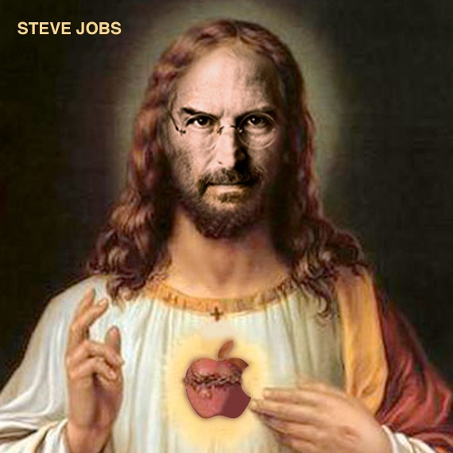

Over the last 5 years or so, design as a part of business has pretty much exploded. That's not to say it didn't exist earlier. Of course it did. But it wasn't as pervasive or valued in business as it has become. 

For the most part, this has been a welcome change. Things moved away from engineer-led cockpit designs to more user-friendly interfaces. Usability and aesthetics finally got their due.

Business, marketing, design, and development all worked in harmony.

Until the Design Simps attacked. 

<!--  -->

## Rise of the Design Simps

Slowly, but surely, power corrupted the design simps, as it always does. Their t-shirt collars slowly elongating into turtenecks. The increasing capabilities of web technology fueling their hunger. And above all, a feverish belief that the path of the righteous designer will one day eradicate all suffering in the world. 

These zealots can usually be safely ignored. However, it starts becoming a problem when these simps start touting design as a fix-all panacea to businesses. Inevitably, it fails, and much like a nasty breakup, the businesses are left with a bitter experience and unwillingness to try again (or maybe I'm projecting 🤷). 

## Design ≠ Problem Solving

There's tendency to the general practice of "Design Thinking" of giving design the sole onus of solving problems. You can generally see this through statements like "designing to improve lives". I appreciate the attempt at simplifying what can be a complex topic -- it can even be useful if you stretch your definition of a problem a bit. 

However, this lack of a clear deliniation between what the problem is and what design will address creates vagary which is of little use beyond a slogan for a college course or agency homepage.

There's very little concensus on what consititutes a problem, and what constitutes a corresponding solution. The closest we come to something sensible is "design is functional art" or something to that effect. 

And that's fine, but it's just explaining what design is. It's not adding any substance to what it means in context of a business with a problem it needs to solve. This issue gets compounded when the business you're talking to isn't design-savvy to begin with (which is the case for the majority of them). All it does is create confusion and mismanages expectations in what design is going to do for them. 

I'm not quite sure if there's some extent of chest-puffing involved when designers present their role like that (because they don't want to be seen as someone who just makes things pretty), or it's just a lack of awareness as an industry.

Yes, <a href="https://lawsofux.com/aesthetic-usability-effect.html" rel="noreferrer noopener" target="blank">aesthetics play a concrete role</a> in how customers experience brand interactions. And as it happens, we typically see two types of design out in the wild. The aesthetic-driven Dribble shots which in reality aren't usable at all, and the kinda-ugly software that hasn't changed in 20 years which enterprises swear by. Honestly, the topic of how pretty a design is is something I prefer to avoid with clients. It's generally way too subjective and adds no real value to the core process. But I digress.

> Beauty is the result of right.

This Japanese proverb essentially means that if something works without a problem, it's automatically beautiful. 

## Design is not an abstract pursuit

Design as a business function has a deterministic scope. It does not concern itself with matters which are beyond what it can measurably affect. [As I've said earlier](../empathy-is-overrated), focusing on "empathy" ends up being one of these fallacies. How do you quantify something like that in context of a business? 

Design, as a business function, has a significantly more objective role in that it has to contribute towards the larger goal. An example I find myself repeating often when teaching these concepts to interns is this one. 

Let's pretend we're running a dry cleaning service. People come to your establishment, drop their fabrics, and get a token for pickup. This works fine, and eventually you're going to plateau. 

So what can you do to break this ceiling? What additional value can you create for your customers that can boost your business?

## The role of design is to help the business, not the other way around

The business does not exist to satisfy your urges as a designer. Your role as a designer exists to improve the experiences for the *business's* users. Your role **does not** exist in a vacuum. You're there to improve the value the business providers for its customers, so that the business can in turn make more money due to happier customers. We need to overcome the notion that design as a business function exists to be *"the sole voice for the users"*. Frankly, in most cases, the Customer Support department will know more about these issues than you as a designer at the company will. 

## Design is not above the development team

Another thing I see are designers thinking their role is somehow at a higher level than the lowly developer grunts. 

## Design alone will not save your business